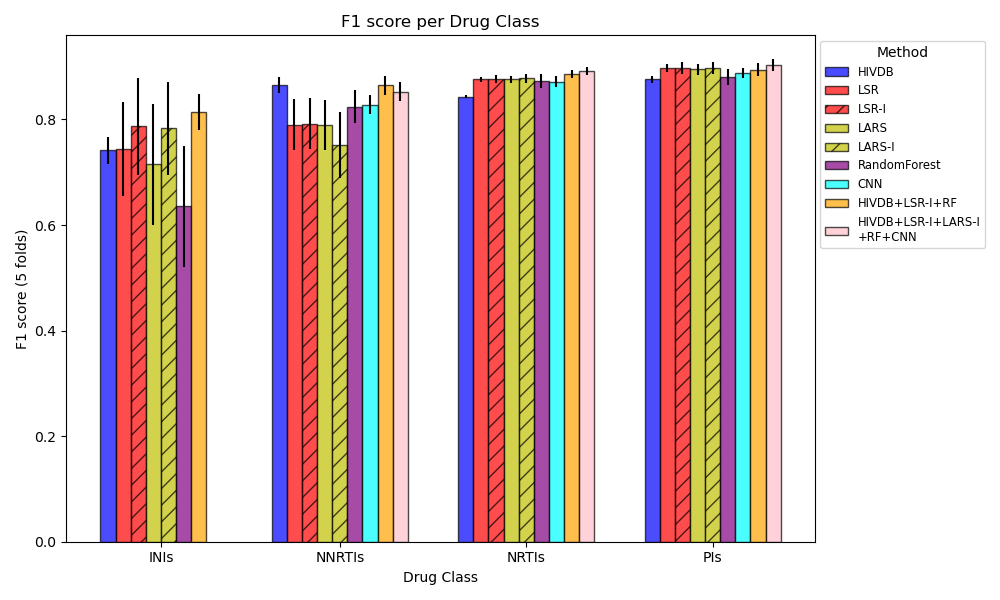

# Comparative analysis and integration of HIV drug resistance mutation testing and prediction tools
This repository contains the data and code needed to reproduce the figures and results from the Master project report held in the Computational Biology Group (D-BSSE, ETH Zürich, Basel) by Miguel Sánchez Marín (MSc Bioinformatics and Biocomplexity, Utrecht University).



## File description
* **HIV_prediction_models/**: contains the scripts used for training and prediction of the different HIV drug resistance prediction methods compared.
    - **cnn_models/**: contains the trained CNN models for the different drugs and folds. 
        - ```{drug}_model_fold_{fold}.keras```: CNN model for drug 'drug' and trained on all folds but number 'fold'.
    - ```HIVDB_prediction.py```: script used to predict the benchmark dataset with HIVDB program (via [sierrapy client](https://github.com/hivdb/sierra-client.git)). Outputs HIVDB predictions in ```method_predictions/HIVDB```.
    - ```cnn_prediction.R```: script used to predict the benchmark dataset with the CNN implementation from [Steiner et al.](https://doi.org/10.3390/v12050560) . Outputs CNN predictions in ```method_predictions/cnn```.
    - ```cnn_training.R```: script used to train the CNN models following the implementation from [Steiner et al.](https://doi.org/10.3390/v12050560) . Trained models stored in ```HIV_prediction_models/cnn_models```.
    - ```ensemble_prediction.py```: script used to retrieve the benchmark dataset predictions from the ensemble approaches explained in the report. Ensemble predictions are stored in ```method_predictions/small_ensemble_predictions.tsv```.
    - ```linear_regression_prediction.R```: script used to predict the benchmark dataset with the linear regression approximations explained in the report (LSR, LARS, LSR-I and LARS-I). The script is adapted from the original implementation by [Rhee et al.](https://doi.org/10.1073/pnas.0607274103). Linear regression predictions are stored in ```method_predictions/linear_regression```.
    - ```random_forest_prediction.py```: script used to predict the benchmark dataset following the random forest implementation by [Raposo et al.](https://doi.org/10.1007/978-3-030-38021-2_6). Random forest predictions are stored in ```method_predictions/random_forest```.
* **datasets/**: contains the datasets used for the method comparison and robustness analysis. Drug susceptibility and mutation data were all obtained from High-quality filtered genotype-phenotype datasets from the public [Stanford HIV drug resistance database](https://hivdb.stanford.edu/pages/genopheno.dataset.html). 
    - **{drug_class}/**: contains independent drug-specific datasets including the fold distribution.
        - ```{drug_class}_{drug}_5folds.tsv```
    - **fasta/**: contains the drug-specific dataset in FASTA format, as required for the CNN implementation.
        - ```{drug}.fasta```
    - **sumsampled_datasets/**: randomly subsampled datasets from the original datasets. Data for increasingly larger missing sequence positions is used for sequence coverage robustness analysis. Obtained with ```utilities/subsample_dataset.py```.
        - ```{drug_class}_subsampled_dataset.tsv```
    - ```{drug_class}_dataset.tsv```: original Stanford HIV drug resistance database datasets after prefiltering done for the report.
    - ```dataset_fold_distribution.tsv```: summary with the sizes of the different folds for every drug dataset and the folds distribution in Resistant and Susceptible labels. Obtained with ```dataset_distribution_plot.py```.
